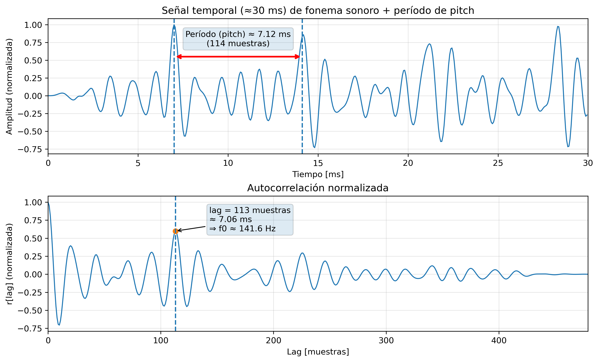
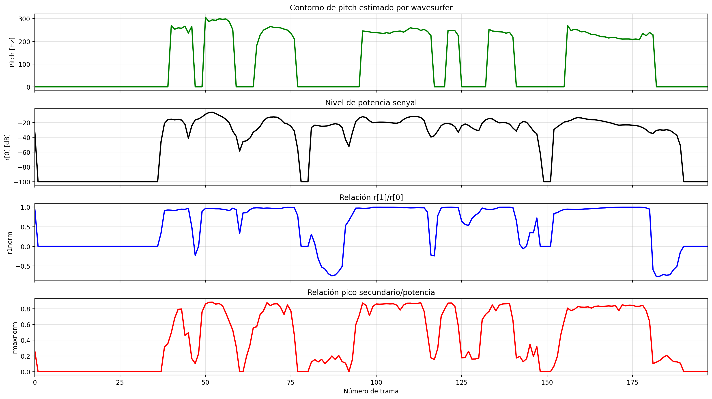
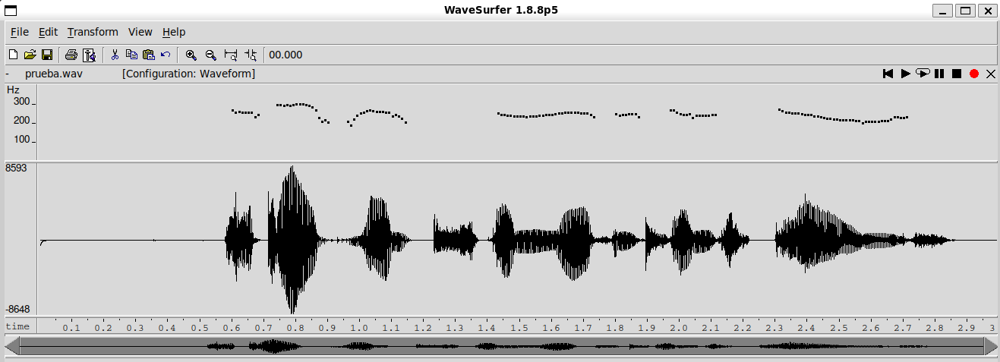
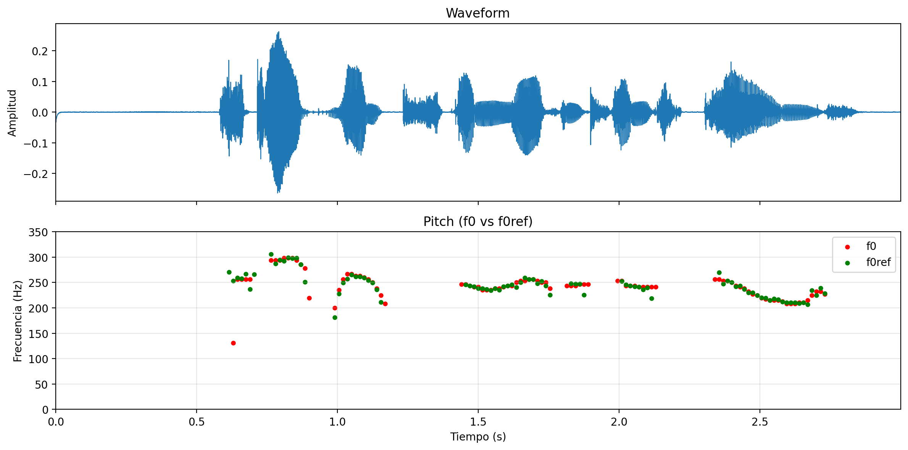
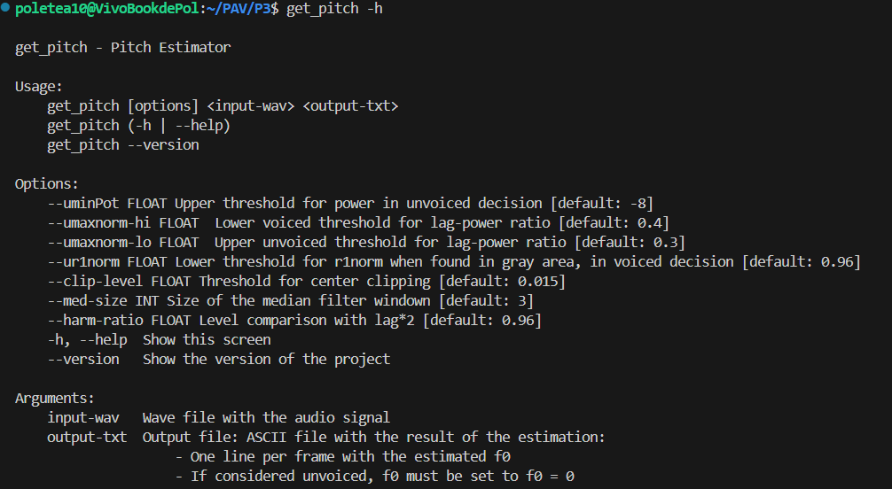
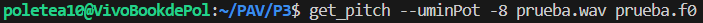
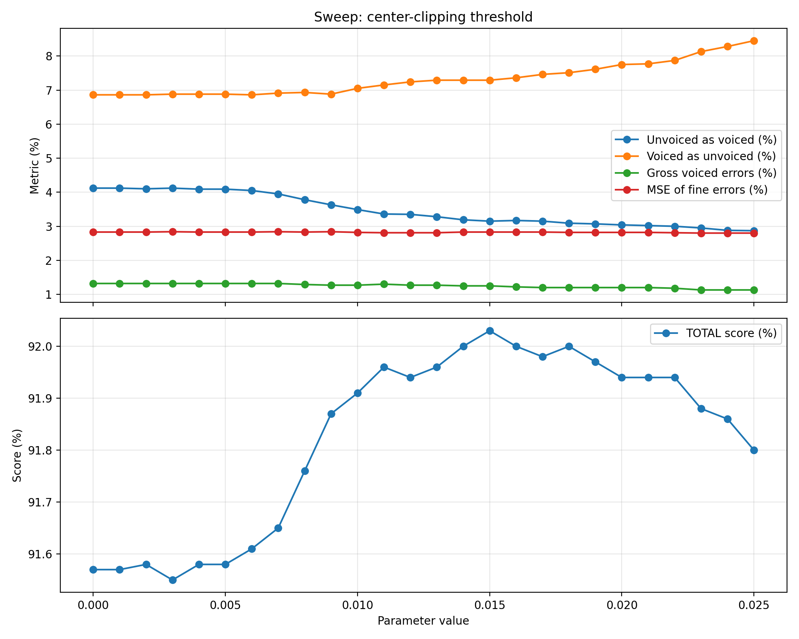
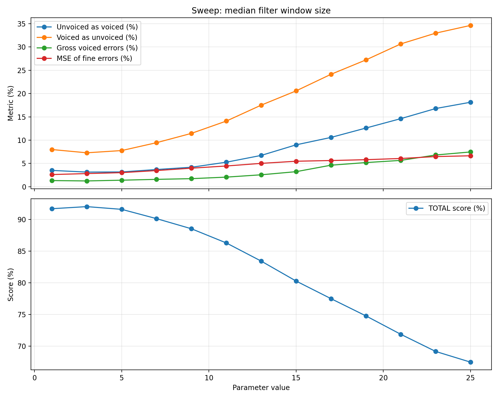

PAV - P3: estimación de pitch
=============================

Esta práctica se distribuye a través del repositorio GitHub [Práctica 3](https://github.com/albino-pav/P3).
Siga las instrucciones de la [Práctica 2](https://github.com/albino-pav/P2) para realizar un `fork` de la
misma y distribuir copias locales (*clones*) del mismo a los distintos integrantes del grupo de prácticas.

Recuerde realizar el *pull request* al repositorio original una vez completada la práctica.

### COMANDOS IMPORTANTES

`make release` -> Compilar el programa

`PATH+=:~/PAV/bin` -> Añade la carpeta `~/PAV/bin` a lista de PATHs de búsqueda de archivos ejecutables, así podremos ejecutar directamente todos los archivos de esa carpeta poniendo su nombre en la terminal (como el de esta práctica, `get pitch`). ¡Lo hemos añadido a `~/.profile` para que se añada este PATH automáticamente al inicializar WSL!

`get_pitch` -> Ejecutar el programa de "pitch estimation", devolviendo...

`run_get_pitch` -> Ejecuta el programa de "pitch estimation" para cada archivo en pitch_db/train/ y evalúa los resultados (evaluación de nuestro programa usando todo el set de audios)


Ejercicios básicos
------------------

- Complete el código de los ficheros necesarios para realizar la estimación de pitch usando el programa
  `get_pitch`.

   * Complete el cálculo de la autocorrelación e inserte a continuación el código correspondiente.
   

   ```cpp
  void PitchAnalyzer::autocorrelation(const vector<float> &x, vector<float> &r) const {

    for (unsigned int l = 0; l < r.size(); ++l) {
      r[l]=0.0F;
      for(unsigned int n=0; n<x.size()-l; n++){
          r[l] += x[n]*x[n + l];
      }
      r[l]=r[l]/static_cast<float>(x.size());
    }


    if (r[0] == 0.0F) //to avoid log() and divide zero 
      r[0] = 1e-10; 
  }
   ```

   * Inserte una gŕafica donde, en un *subplot*, se vea con claridad la señal temporal de un segmento de
     unos 30 ms de un fonema sonoro y su periodo de pitch; y, en otro *subplot*, se vea con claridad la
	 autocorrelación de la señal y la posición del primer máximo secundario.

	 NOTA: es más que probable que tenga que usar Python, Octave/MATLAB u otro programa semejante para
	 hacerlo. Se valorará la utilización de la biblioteca matplotlib de Python.

   Aquí la gráfica que se pide (el segmento del fonema sonoro ha sido generado artificialmente, usando un tren de deltas pasado por un resonador de formantes):

   

   * Determine el mejor candidato para el periodo de pitch localizando el primer máximo secundario de la
     autocorrelación. Inserte a continuación el código correspondiente.
  
  Este **no es el método usado en la versión final** para buscar el mejor candidato del periode de pitch (se puede ver en la parte avanzada). **Nos basamos en lo que pide este enunciado**, sólo añadiendo el código que localiza el primer máximo secundario de la autocorrelación:

  ```cpp
  vector<float>::const_iterator iR_clip = r_clip.begin(), iRMax_clip = iR_clip;

  iRMax_clip = std::max_element(iR_clip + npitch_min, iR_clip + npitch_max);

  unsigned int lagR_clip = iRMax_clip - r_clip.begin();
  ```

  Le llamamos `r_clip` en vez de `r` a secas porque en nuestro código se calculan dos autocorrelaciones (una con center-clipping y otra sin). Se explica mejor en la parte avanzada.

   * Implemente la regla de decisión sonoro o sordo e inserte el código correspondiente.

  ```cpp
  bool PitchAnalyzer::unvoiced(float pot, float r1norm, float rmaxnorm) const {
    if (pot < this->uminPot)
        return true;
    
    if (rmaxnorm > this->umaxnorm_hi)
        return false;
    
    if (rmaxnorm < this->umaxnorm_lo)
        return true;

    if (r1norm >= this->ur1norm)
      return false;
    else 
      return true;
  }
  ```

  Nos basamos en una **táctica de descarte**. Como pone al final de nuestro TODO: _It first tags all low power frames as unvoiced. The other ones are checked by rmaxnorm and, if they fall in a "Grey area", we check r1norm (voiced parts tend to change slowly with just a 1 sample lag)_

   * Puede serle útil seguir las instrucciones contenidas en el documento adjunto `código.pdf`.

- Una vez completados los puntos anteriores, dispondrá de una primera versión del estimador de pitch. El 
  resto del trabajo consiste, básicamente, en obtener las mejores prestaciones posibles con él.

  * Utilice el programa `wavesurfer` para analizar las condiciones apropiadas para determinar si un
    segmento es sonoro o sordo. 
	
	  - Inserte una gráfica con la estimación de pitch incorporada a `wavesurfer` y, junto a ella, los 
	    principales candidatos para determinar la sonoridad de la voz: el nivel de potencia de la señal
		(r[0]), la autocorrelación normalizada de uno (r1norm = r[1] / r[0]) y el valor de la
		autocorrelación en su máximo secundario (rmaxnorm = r[lag] / r[0]).

		Puede considerar, también, la conveniencia de usar la tasa de cruces por cero.

	    Recuerde configurar los paneles de datos para que el desplazamiento de ventana sea el adecuado, que
		en esta práctica es de 15 ms.

    Aquí podemos ver la comparación entre la estimación de pitch hecha por `wavesurfer` y nuestras métricas:

    

    Tras observar la relación entre las métricas disponibles y la estimación de pitch esperada, hemos inferido este protocolo para determinar la sonoridad de una trama:

    **Táctica de descarte:** 
    Cuando hay muy **poca potencia** en la trama, está se puede **clasificar directamente como UV**. **En potencias altas aún se han de hacer más pruebas** para confirmar sonoridad (como se puede ver en la parte de las tramas 75-100).

    Para las tramas que tienen potencia alta, **pasamos a fijarnos en rmaxnorm**. En general, los **rmaxnorm altos** corresponden a las **partes sonoras**, y **los bajos** a las **partes no sonoras**. Sin embargo, hay valores de rmaxnorm intermedios que se consideran **"zonas grises"**, ya que no indican bien si es una parte sonora o no. Esto se puede ver en la primera parte sonora del gráfico anterior.

    Cuando rmaxnorm se encuentra en un punto intermedio, donde la sonoridad es aún dudosa, **pasamos a mirar r1norm**. Un **r1norm bajo**, dado que nos encontramos en una "zona dudosa", acostumbra siempre a indicar que es una **parte UV**. Por otra parte, si estamos en la "zona dudosa" y **r1norm es alto**, entonces será una **parte sonora**.

      - Use el estimador de pitch implementado en el programa `wavesurfer` en una señal de prueba y compare
	    su resultado con el obtenido por la mejor versión de su propio sistema.  Inserte una gráfica
		ilustrativa del resultado de ambos estimadores.
     
		Aunque puede usar el propio Wavesurfer para obtener la representación, se valorará
	 	el uso de alternativas de mayor calidad (particularmente Python).

    Aquí una captura del pitch que ha estimado `wavesurfer` en el audio *prueba.wav*:

    

    Y aquí una comparación de nuestra estimación con la de wavesurfer (hecha con matplotlib). En **verde** podemos ver el valor estimado por `wavesurfer` y en **rojo** la estimación de nuestro programa:

    

    Como se puede ver, nuestros resultados son bastantes cercanos al Groundtruth establecido por `wavesurfer`, y hay muy pocos fallos por lo que se refiere a la estimación de las partes sonoras/no sonoras. Sin embargo, cabe destacar la presencia de errores groseros (o relativamente grandes) a principios y finales de cada segmento de sonoridad.
  
  * Optimice los parámetros de su sistema de estimación de pitch e inserte una tabla con las tasas de error
    y el *score* TOTAL proporcionados por `pitch_evaluate` en la evaluación de la base de datos 
	`pitch_db/train`..

  Estos son los resultados de nuestro programa de estimación de pitch final (con los métodos añadidos en la parte de ampliación):

  **Num. frames evaluated: 11200 = 7045 unvoiced + 4155 voiced**

    | **Error Type**                   | **Number of errors** |   **%**    |
  |----------------------------------|----------------------|------------|
  | Unvoiced frames as voiced        | 222/7045             | 3.15 %     |
  | Voiced frames as unvoiced        | 303/4155             | 7.29 %     |
  | Gross voiced errors (+20 %)      | 48/3887              | 1.25 %     |
  | MSE of fine errors               | –                    | 2.83 %     |
  | **TOTAL**                        | –                    | **92.03 %**|


Ejercicios de ampliación
------------------------

- Usando la librería `docopt_cpp`, modifique el fichero `get_pitch.cpp` para incorporar los parámetros del
  estimador a los argumentos de la línea de comandos.
  
  Esta técnica le resultará especialmente útil para optimizar los parámetros del estimador. Recuerde que
  una parte importante de la evaluación recaerá en el resultado obtenido en la estimación de pitch en la
  base de datos.

  * Inserte un *pantallazo* en el que se vea el mensaje de ayuda del programa y un ejemplo de utilización
    con los argumentos añadidos.

  PANTALLAZO MENSAJE AYUDA:

  

  PANTALLO EJEMPLO UTILIZACIÓN (sólo usando una opción como ejemplo):
    
  

- Implemente las técnicas que considere oportunas para optimizar las prestaciones del sistema de estimación
  de pitch.

  Entre las posibles mejoras, puede escoger una o más de las siguientes:

  * Técnicas de preprocesado: filtrado paso bajo, diezmado, normalizado, *center clipping*, etc.
  
  Se ha añadido como técnica de preprocesado:
  - Un **normalizado de la señal**
  ```cpp
  // Frame normalization
  float max = *std::max_element(x_norm.begin(), x_norm.end());
  for (int i = 0; i < (int)x_norm.size(); i++)
    x_norm[i] /= max;
  ```

  - Un **center clipping** sin *offset* (se hace en `pitch_analyzer.cpp` en vez de `get_pitch.cpp`, ya que para el método COSA, explicado más adelante, se necesita la señal sin clipping. *Clipear* la señal antes de enviarla a `pitch_analyzer.cpp` imposibilita el uso del método COSA).
  ```cpp
  // Center clipping for voiced detection
  vector<float> x_clip = x;
  for (float &sample : x_clip) {
    if (fabsf(sample) < this->clip_level) {
      sample = 0.0f;
    }
  ```
  El `clip_level` se ha añadido como argumento de entrada para poderlo optimizar. Se ha probado de hacer el clipping con *offset* pero nos daba peores prestaciones.

  - El uso de la **ventana Hamming**. Se ha añadido como parámetro opcional a la hora de llamar al `analyzer`. En nuestra versión final NO se usa, ya que devolvía peores prestaciones.

  ```cpp
  void PitchAnalyzer::set_window(Window win_type) {
    if (frameLen == 0)
      return;

    window.resize(frameLen);

    switch (win_type) {
    case HAMMING:
      /// \TODO Implement the Hamming window
      for (unsigned int n = 0; n < frameLen; ++n) {
        window[n] = 0.54f - 0.46f * cosf(2.0f * M_PI * n / (frameLen - 1));
      } 
      /// \DONE Hamming window implemented, though its use is not recommended (RECT windows give better results)
      break;
    case RECT:
    default:
      window.assign(frameLen, 1); // Square window (1 coefficients for the whole frameLen)
    }
  }
  ```

  * Técnicas de postprocesado: filtro de mediana, *dynamic time warping*, etc.

  Se ha añadido como técnica de postprocesado un **filtro de mediana** con tamaño de ventana ajustable (para optimizarlo cambiando el argumento de entrada):

  ```cpp
  /// Postprocess: Median filter
  if (f0.size() >= med_size) {
    vector<float> f0_med(f0.size());
      
    // First y and last frames untouched
    f0_med[0] = f0[0];
    f0_med.back() = f0.back();
      
    // Median for center frames
    size_t half = (med_size - 1) / 2;
    for(size_t i = half; i + half < f0.size() - 1; ++i) {
      vector<float> window;
      window.reserve(med_size);

      for (size_t j = i - half; j <= i + half; ++j)
        window.push_back(f0[j]);

      sort(window.begin(), window.end());
      f0_med[i] = window[half];   // median
    }
      
    f0 = f0_med;
  }
  ```

  * Métodos alternativos a la autocorrelación: procesado cepstral, *average magnitude difference function*
    (AMDF), etc.

  Se ha probado el uso de la **función AMDF** para calcular el pitch, pero sus prestaciones eran peores (se ha intentado usar como valor de referencia de pitch si la diferencia con el lag de la autocorrelación estaba a una distancia ±20%, pero tampoco mejoraba):

  ```cpp
  // Pitch estimation AMDF method (not used here since it gives worse performance than Autocorrelation/COSA)
  void PitchAnalyzer::amdf(const std::vector<float> &x, std::vector<float> &d) const {
    const unsigned int N = (unsigned int)x.size();
    const unsigned int L = (unsigned int)d.size(); // npitch_max

    for (unsigned int l = 0; l < L; ++l) { // For all permitted lags
      float acc = 0.0f;

      for (unsigned int n = 0; n < N - l; ++n) {
        acc += fabsf(x[n] - x[n + l]);
      }
      d[l] = acc / (float)(N-l); // Normalized since we're windowing and not all lags are calculated from the same number of samples
    }
  } 
  ```

  La parte del código que buscaba su mínimo no se ha acabado incluyendo ya que este método daba peores prestaciones.

  * Optimización **demostrable** de los parámetros que gobiernan el estimador, en concreto, de los que
    gobiernan la decisión sonoro/sordo.

  Se han optimizado los valores de los parámetros que gobiernan la decisión sonoro/sordo (a parte de otros parámetros usados para el procesado de señal y estimación de pitch) en el archivo `som-hi.sh`. **Aquí el código que optimiza los parámetros usados para detectar partes V/UV:**

  ```
  # Buscamos mejor combinación de umbrales para reconocer partes voiced/unvoiced
  for pot in $(seq -- -34 0.1 -36); do
      for hi in $(seq 0.39 0.01 0.41); do
          for lo in $(seq 0.28 0.01 0.31); do
              for r1 in $(seq 0.94 0.02 0.98); do
                  echo -ne "$pot $hi $lo $r1\t" # Imprime los valores actuales
                  scripts/run_get_pitch.sh $pot $hi $lo $r1 | grep TOTAL # Ejecuta el Test para los valores actuales y imprime su Fscore total (solo imprimiendo la línea con la palabra "TOTAL")
              done
          done
      done
  done | sort -t: -k 2n # Ordena resultados por Fscores de mayor a menor
  ```


  * Cualquier otra técnica que se le pueda ocurrir o encuentre en la literatura. 
  
  Las siguientes técnicas también han sido usadas:

  - **Comparación de nivel con siguiente armónico**
  
  Se ha detectado que una **gran parte de los errores groseros vienen de detectar el segundo armónico en vez de la frecuencia fundamental**. Una buena manera de ver si esto ha ocurrido (comprobado después de hacer varios experimentos) es **comparando `r[lag]` con `r[lag/2]`** (el pico detectado con el pico del siguiente armónico) -> si son muy parecidos, seguramente estamos mirando al segundo y tercer armónico (la frecuencia fundamental acostumbra a tener mucha diferencia respecto el segundo armónico).

  **Cuando detectamos este error, cambiamos el valor del lag actual a `lag=lag*2`.** De esta manera, cojemos la frecuencia fundamental. Aquí la parte del código que lo hace:

  ```cpp
  if (npitch_max>=lagR_clip*2 && r_clip[lagR_clip/2] >= this->harm_ratio * r_clip[lagR_clip]){ // If largR/2 is really similar to lagR, we might be looking at a harmonic (harmonic consistency). So the fundamental should be at lagR*2
    lagR_clip = lagR_clip*2;
    bestLag = lagR_clip*2;
  }
  ```

  **Se diferencian `lagR_clip` y `bestLag` ya que uno lo usamos para detectar sonoridad y el otro para el pitch.** `lagR_clip` sólo usa lags obtenidos a partir de la autocorrelación, mientras que `bestLag` mezcla la predicción de la autocorrelación y la del algoritmo COSA (más adelante). No se usa el algoritmo COSA para detectar sonoridad ya que en el paper original se dice que no tiene tan buenas prestaciones para esa tarea.

  - **Algoritmo COSA** para detección de pitch

  Para **reducir el número de errores groseros**, también se ha implementado el **algoritmo COSA para detectar pitch**. Para entender bien su funcionamiento se puede leer su [paper original](https://upcommons.upc.edu/server/api/core/bitstreams/3dc9625f-f112-4584-85c7-99927427185d/content).

  En resumen, **el algoritmo COSA estima el pitch calculando el cepstrum de la autocorrelación unilateral de la señal**, lo que permite atenuar la influencia de los formantes y del ruido sin recurrir a center clipping. Esta transformación destaca de forma más robusta el pico asociado al período fundamental, especialmente en segmentos no estacionarios, reduciendo así el número de errores groseros.
  
  Aquí la parte del código que calcula el cepstrum complejo y encuentra su máximo (con K=100, recomendada en el paper):

  ```cpp
  vector<float> r_cosa(npitch_max);

  autocorrelation(x, r_cosa);
  r_cosa[0] = 100*r_cosa[0]; // Multiply by K = 100 to reduce COSA oscillation
  r_cosa[0] = r_cosa[0]*0.5; // Now we have the one-sided autocorrelation (with reduced COSA oscillation)

  // Complex cepstrum of the one-sided correlation (COSA)
  vector<float> COSA(npitch_max);
  COSA[0]=log10(r_cosa[0]);
  for (unsigned int n = 1; n < COSA.size(); ++n) {

    float s = 0.0f;

    // s = sum_{k=1..n-1} (k/n) * Cplus[k] * Rplus[n-k]
    for (unsigned int k = 1; k < n; ++k) {
        s += ((float)k / (float)n) * COSA[k] * r_cosa[n - k];
    }

    // Cplus[n] = (Rplus[n] - s) / Rplus[0]
    COSA[n] = (r_cosa[n] - s) / r_cosa[0];
  }

  vector<float>::const_iterator iR_cosa = COSA.begin(), iRMax_cosa = iR_cosa;

  iRMax_cosa = std::max_element(iR_cosa + npitch_min, iR_cosa + npitch_max);

  unsigned int lagR_cosa = iRMax_cosa - COSA.begin();
  ```
  
  Cabe destacar que: (1) como este algoritmo no recurre al center clipping, el preprocesado se hace por separado en `pitch_analyzer.cpp`, y (2) el método COSA destaca por su reducción de errores groseros, NO por una mejor detección de sonoridad. Por lo tanto, **sólo usamos el valor del lagR_cosa como *fallback* cuando se detecta una distancia de +20% respecto el lag obtenido con la autocorrelación**:

  ```cpp
  unsigned int bestLag = lagR_clip;
  float ratio = (float)lagR_cosa / (float)lagR_clip;

  // if lagR_cosa is above +20% of lagR_clip (normally gross errors are caused by overestimating the pitch, so we should get the lower pitch/higher lag)
  if (ratio >= 1.2f)
        bestLag = lagR_cosa;
  ```

  - **Reducción del rango de pitch permitido** (reduce computo y mejora prestaciones ligeramente)

  El rango de pitch permitido originalmente era de 50Hz a 500Hz. Sin embargo, hemos visto que este rango es demasiado ancho y no ayuda a las prestaciones de nuestro sistema de estimación de pitch, sobretodo porque lo hace menos robusto a la detección (errónea) de segundos armónicos. Para mejorarlo, **hemos reducido el rango de pitch a 50Hz-350Hz** (que además de mejorar las prestaciones, reduce el computo al buscar el máximo en un intervalo npitch_min-npitch_max menor).

  --

  Encontrará más información acerca de estas técnicas en las [Transparencias del Curso](https://atenea.upc.edu/pluginfile.php/2908770/mod_resource/content/3/2b_PS%20Techniques.pdf)
  y en [Spoken Language Processing](https://discovery.upc.edu/iii/encore/record/C__Rb1233593?lang=cat).
  También encontrará más información en los anexos del enunciado de esta práctica.

  Incluya, a continuación, una explicación de las técnicas incorporadas al estimador. Se valorará la
  inclusión de gráficas, tablas, código o cualquier otra cosa que ayude a comprender el trabajo realizado.

  **RESUMEN TÉCNICAS INCORPORADAS AL ESTIMADOR:**
  - Como preprocesado inicial, **cada trama es normalizada respecto su valor máximo**
  - Después la trama se envía al analyzer, con el **rango de pitch permitido siendo 50Hz-350Hz**
  - Dentro del analyzer, se calcula **(1)** el **lag** correspondiente al segundo máximo de la __autocorrelación de la señal con *center-clipping* sin *offset*__, y **(2)** el **lag** correspondiente al **segundo máximo del COSA** (*"cepstrum of the one-sided autocorrelation"*), para la señal SIN *center-clipping*
  - Para evitar *gross errors*, se hace la **comparación con el siguiente armónico** (para ver si estamos realmente en la frecuencia fundamental) y también hacemos la **comparación de ambos lags** (`lagR_clip` vs `lagR_cosa`; en caso de *gross error* superior, nos quedamos con `lagR_cosa`)
  - Para **detectar la sonoridad**, se usa la **"táctica de descarte"** con varios umbrales explicada en la parte básica
  - Como técnica de post-procesado, usamos un **filtro de mediana con tamaño de venta 3**.

  También se valorará la realización de un estudio de los parámetros involucrados. Por ejemplo, si se opta
  por implementar el filtro de mediana, se valorará el análisis de los resultados obtenidos en función de
  la longitud del filtro. 
  
  Aquí un análisis de **como varían las métricas** (% de error y % de score) **según los siguientes parámetros**:

  - **Umbral center clipping sin offset**

  

  - **Longitud filtro de mediana**

  


  Los otros parámetros se han dejado en su valor *default* para hacer un análisis aislado de ambos. Hemos usado el archivo `analisis_parametros.sh` para ver como varían las métricas, graficando después los resultados con python. 
  
  IMPORTANTE! Fíjese en las escalas del eje Y, ya que son diferentes para ambos análisis. La variación del umbral para center-clipping produce cambios más pequeños en las métricas que la variación de la longitud del filtro de mediana.
   

Evaluación *ciega* del estimador
-------------------------------

Antes de realizar el *pull request* debe asegurarse de que su repositorio contiene los ficheros necesarios
para compilar los programas correctamente ejecutando `make release`.

Con los ejecutables construidos de esta manera, los profesores de la asignatura procederán a evaluar el
estimador con la parte de test de la base de datos (desconocida para los alumnos). Una parte importante de
la nota de la práctica recaerá en el resultado de esta evaluación.
